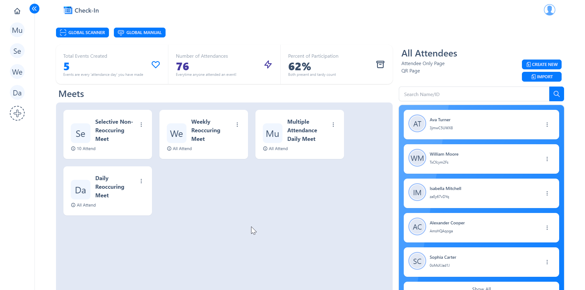
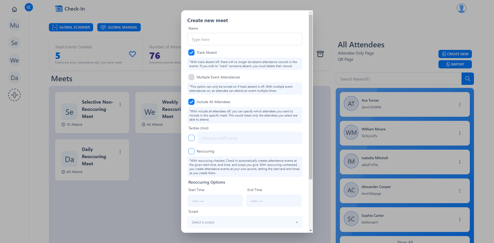
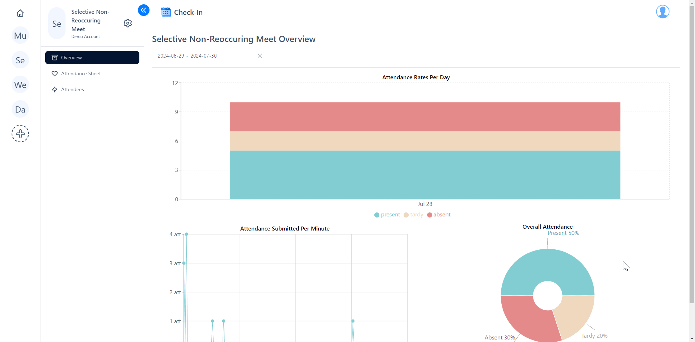
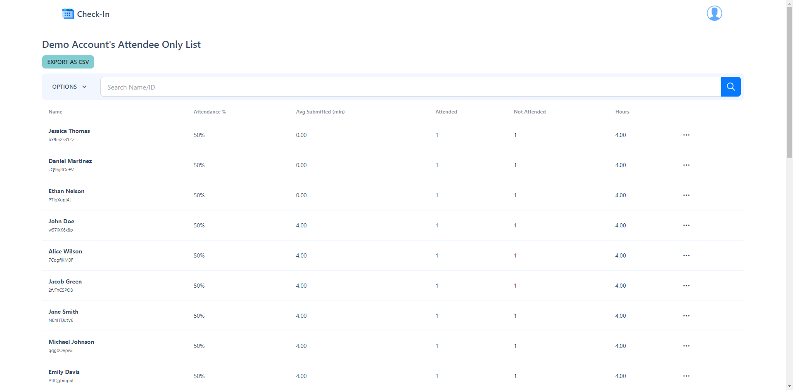

# Check-In Preview

*Dashboard Images/Videos are included*

Check-In is an automated attendance management system designed to simplify tracking attendance. With QR codes and unique IDs, Check-In makes attendance tracking quick and easy. This system is perfect for events where efficiency and accuracy are crucial.

## How it works

#### **1. Meets**
- Organizer accounts create meets as the primary group that events fall under. For example, a classroom can be a meet, and each day of class can be an event. Meets are highly customizable.

#### **2. Attendees**
- The individuals who will attend the events. They are holistically tied to the organizer but specifically to individual meets.

#### **3. Events**
- The specific occurrences under a meet. Events are where attendance is tracked.

#### **4. Attendances**
- The records of who attended which event. This can be done through QR codes, unique IDs, or manually as an organizer.

## Dashboard

#### **On the Dashboard, you can:**
- Create new attendees or import them from a CSV file.
- View or edit existing attendees.
- See data related to events, attendances, and attendance rates.
- Manage all your created meets.

## Meet Creation

#### **Meets offer extensive customization options:**
- **Name**
- **Track Absent:** Toggle absent tracking on or off.
- **Multiple Event Attendances:** Allows an attendee to check in multiple times for the same event.
- **Include All Attendees:** Specify which attendees are included.
- **Tardies:** Set a threshold for marking attendees as tardy.
- **Reoccurring Events:** Automatically generate events based on a set schedule.
- **Meet Picture:** Add an image to represent the meet.

## Inside a Meet

#### **Each meet contains four pages:**
- **Overview**: View charts and statistics about attendance.
- **Attendance Sheet**: Search for events and manually edit attendance records.
- **Attendees**: Manage attendees for the meet.
- **Settings**: Configure meet-specific settings.

## Attendance Collection

#### **Multiple ways to collect:**
- **Global Scanner:** Scan QR codes to log attendance.
- **Global Manual:** Enter unique IDs to log attendance.

When scanned or entered, the system automatically identifies the meet and the current event, logging the attendance accordingly. If there are multiple events going on simultaneously, it will prompt you to choose one.

## Attendee List

The Attendee List page allows you to select meets and dates to view detailed attendance data. You can see which events attendees have attended or missed, their overall attendance rate, and more.
